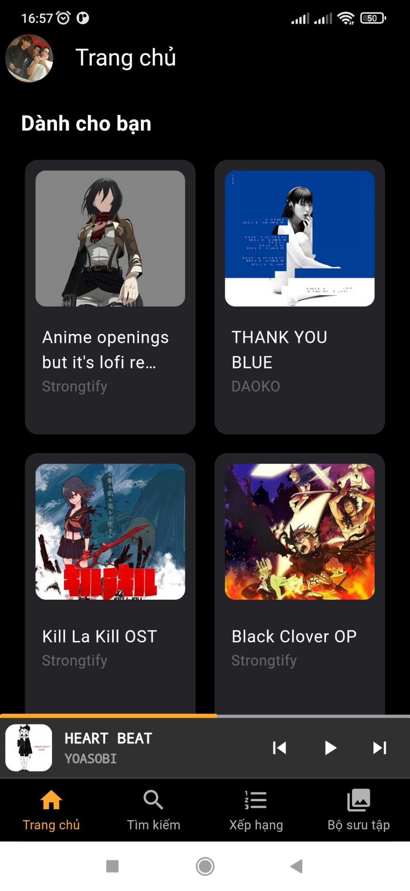
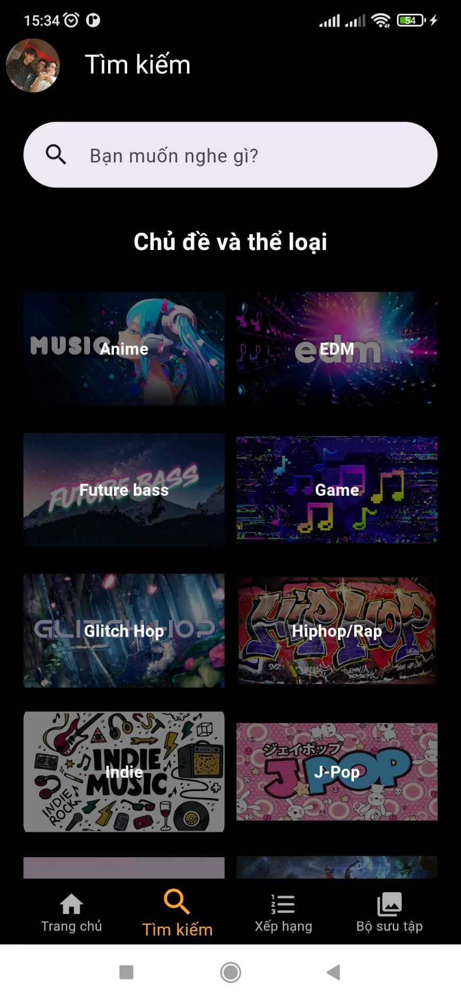
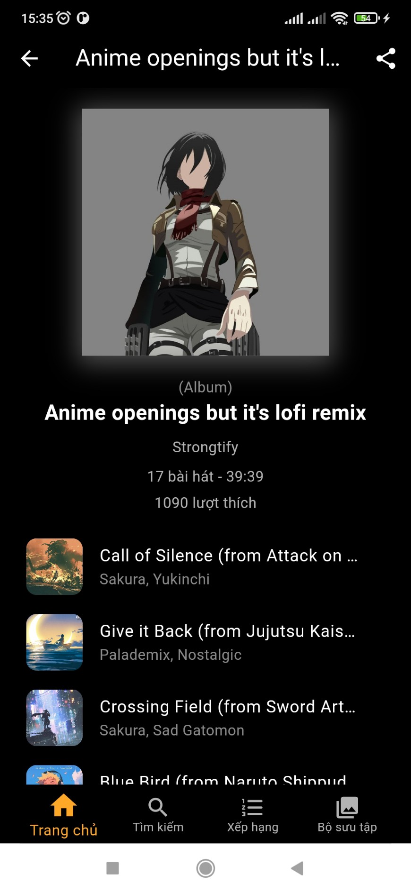
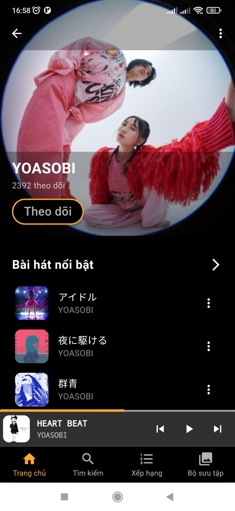
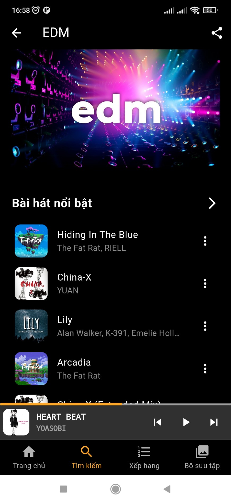
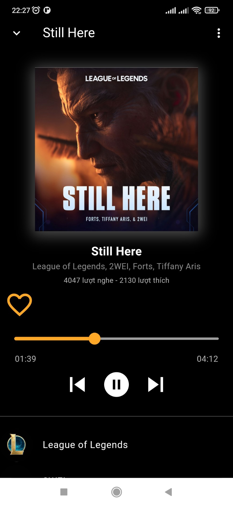
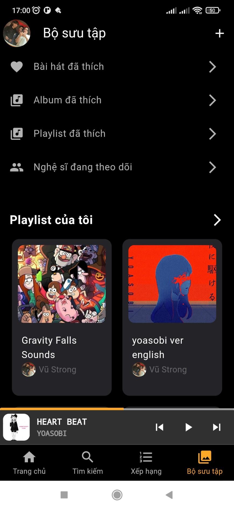
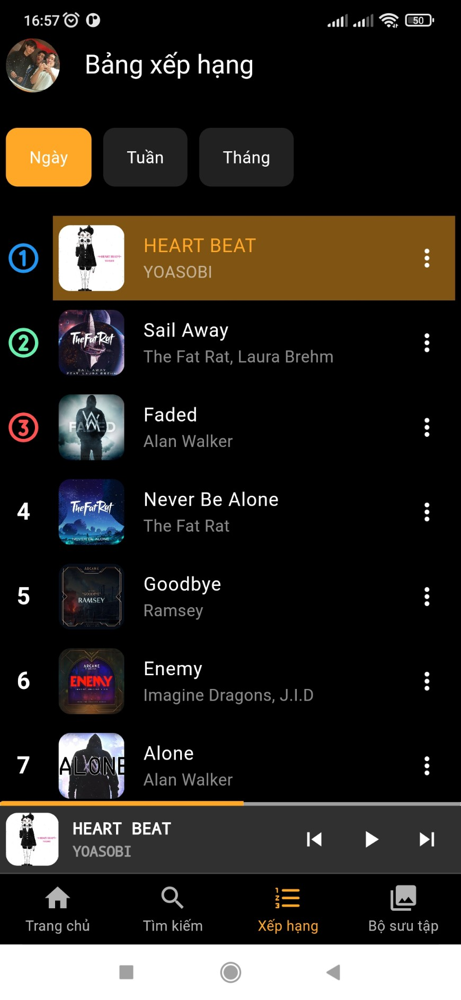

# Strongtify

A music streaming website and application using `NestJS` for backend, `NextJS` for web client and `Flutter` for mobile app.

- Website: https://strongtify.io.vn/.
- Swagger Doc: https://api.strongtify.io.vn/api.
- Download APK: <a href='https://drive.google.com/drive/folders/14ppGTX69XSTXeYmz6uO4NJtKYsB61jvz?usp=sharing'>Here</a> 

## Features

- Backend using NestJS, PlanetScale MySQL as main database and Redis for caching.
- Web client using NextJS, NextAuth for storing token.
- Mobile App using Flutter and BLoC pattern for state management.

## Screenshots

### Web Client

    
View Screenshots

     

  
  
  
  
  
  

### Mobile app

    
View Screenshots

     

|  |  |  |
| :---:  | :---:  | :---:  |
|             |                |  
|             |              |  
|            |          | 

  
